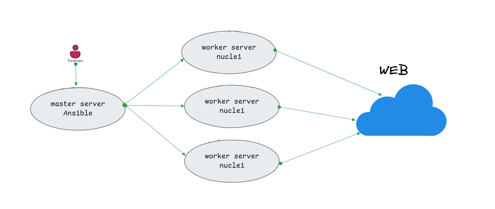

# Ansible Role: Nuclei Scanner

This Ansible Galaxy role installs and configures the [Nuclei Scanner](https://github.com/projectdiscovery/nuclei), a powerful tool for vulnerability scanning and configuration management.

## Requirements

- Supported Operating Systems: Linux (e.g., Ubuntu, CentOS) , Windows and Mac 
- Dependencies:
  - `unzip` package must be available on the system.

## Role Variables

Available variables are listed below, along with their default values in `defaults/main.yml`:


```yaml
nuclei_download_url: "https://github.com/projectdiscovery/nuclei/releases/latest/download/nuclei.zip"
nuclei_install_path: "/usr/local/bin"
nuclei_data_path: "/opt/nuclei-templates"
```

## Dependencies

This role has no specific dependencies.

## Example Playbook

for example `install_nuclei.yml`

```yaml
---
- name: Install and run nuclei
  hosts: target-machines
  become: true
  roles:
    - nuclei

```

for `ansible.cfg`

```ini
[default]
inventory   = ./inventory.ini
remote_user = root
log_path    = ./log/ansible.log

[privilege_escalation]
become = true
become_user = root
become_method = sudo
```

for `inventory.ini` file
```ini
[target-machines]
192.168.56.10 ansible_user=root
192.168.56.11 ansible_user=root
```

### Architect



## Role Tasks

### 1. Download and Install Nuclei Binary

- Downloads the Nuclei binary ZIP file from the specified URL.
- Extracts the binary to the defined installation path.
- Ensures the installation directory exists.

### 2. Download and Update Templates

- Downloads the latest Nuclei templates to the defined data path.
- Updates templates if they already exist.

### 3. Run Nuclei Scanner

- Provides a simple wrapper for running the `nuclei` binary with specific options.

## Example Command

After installing the role, you can run Nuclei as follows:

for spilt input list:
copy input file into /tmp/input.txt

```sh
cp <your input list> /tmp/input.txt

ansible-playbook -i inventory.ini  ./install_nuclei.yml  --tags "split"

```
for running single target use `-u <host>`

‍‍‍‍‍```sh

ansible-playbook -i inventory.ini  ./install_nuclei.yml -e "nuclei_args= -u example.com -t ssl "  --tags "run"

```

for running list targets

```sh

ansible-playbook -i inventory.ini  ./install_nuclei.yml -e "nuclei_args='-list /tmp/*.csv -t ssl'"  --tags "run"

```

for collect results from workers:

```sh

ansible-playbook -i inventory.ini  ./install_nuclei.yml   --tags "collect"

```

## License

MIT

## Author Information

This role was created by DannyRavi.

